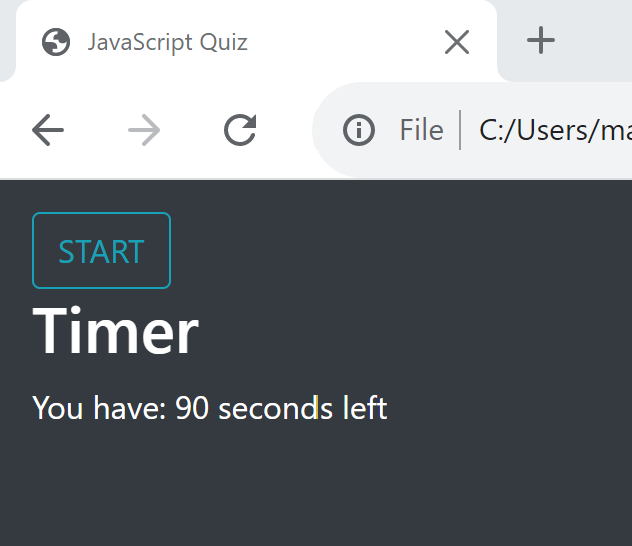
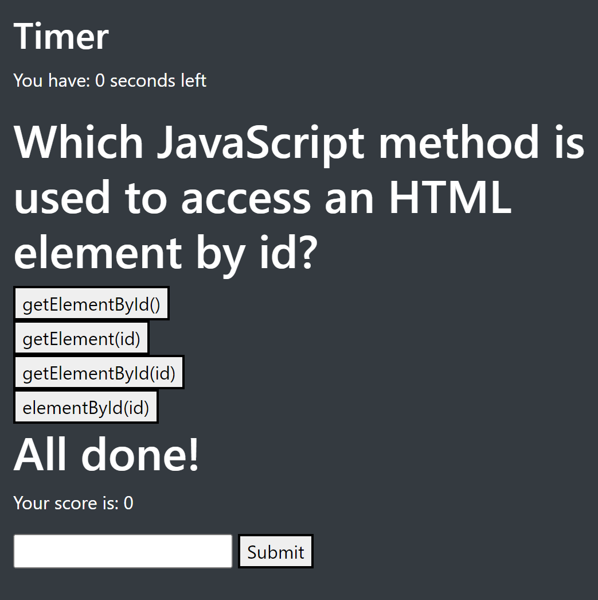

# JavaScript Fundamentals Quiz

## Description/Purpose

A coding student needs to be prepared to complete a coding assessment for future interviews.

The quiz must include:
- A timer that subtracts seconds as a penalty for getting the wrong answer
- The student loses if the timer runs out
- Questions that are presented once the previous question has been answered
- A field to submit their initials and record highscores
- The ability to play again without losing the initial and highscore information

## Mock-Ups

This is the screen on load.

This is the first screen.

What happens if the timer runs out.

